# MedCare — Hospital Management System

A comprehensive, role-based **Hospital Information Management System** built with Django. Designed for hospitals and diagnostic centers to manage patients, doctors, appointments, billing, pharmacy, laboratory, radiology, IPD/OPD, nursing, inventory, HR, and administrative workflows — all from a single dashboard.

> **Project Status:** Active Development  
> **License:** MIT


---

## Table of Contents

- [Features](#features)
- [Screenshots](#screenshots)
- [Tech Stack](#tech-stack)
- [Project Structure](#project-structure)
- [Quick Start](#quick-start)
- [Default Credentials](#default-credentials)
- [Usage Guide](#usage-guide)
- [Deployment](#deployment)
- [Contributing](#contributing)
- [License](#license)

---

## Features

### 🔐 Authentication & Roles
- Custom `User` model with 10 roles: **Super Admin**, **Hospital Admin**, **Doctor**, **Nurse**, **Receptionist**, **Pharmacist**, **Lab Technician**, **Accountant**, **HR Manager**, **Patient**
- Secure login with session management
- Public patient self-registration with auto-account creation
- Role-based access control via decorators (FBV) and mixins (CBV)
- Superusers bypass all role restrictions automatically


### 👤 Patient Management
- Full **CRUD** for patient profiles with auto-generated patient IDs (`PAT-XXXXX`)
- Medical records linked to patients and doctors
- Patient document uploads (ID proof, insurance card, lab reports, prescriptions, discharge summaries)
- Search by patient ID, name, blood group, insurance provider
- Role-based visibility: patients see only their own records; staff see all

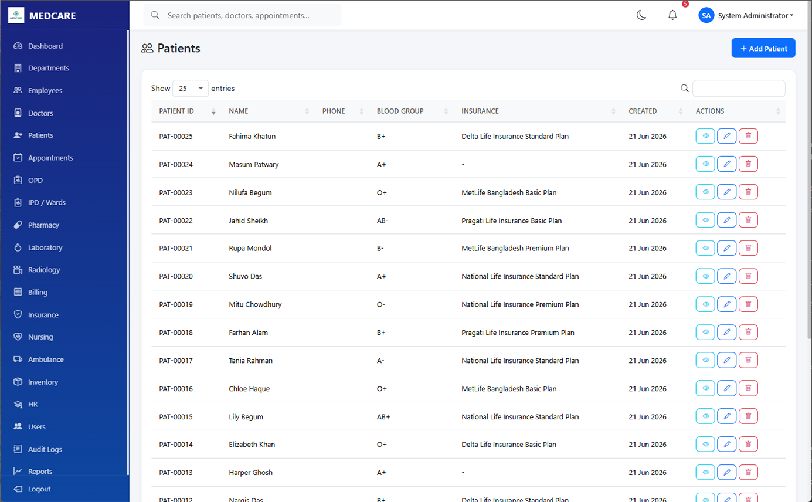

### 🩺 Doctor Management
- Doctor profiles linked to employees with specialization, consultation fee, and experience
- Weekly schedule management (day-of-week based)
- Date-specific availability with max patient slots and remaining capacity tracking
- Availability toggle for online/offline status

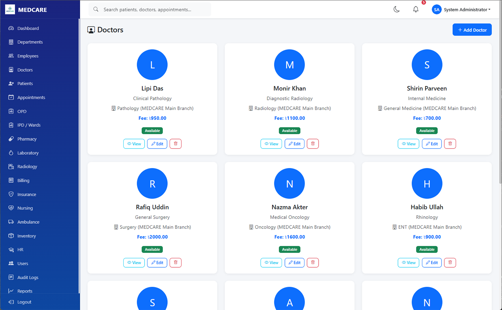

### 📅 Appointments & Visits
- Appointment types: **OPD**, **IPD**, **Emergency**, **Online**
- Status workflow: Scheduled → Confirmed → In-Progress → Completed / Cancelled / No-Show
- Visit records with doctor notes, diagnosis, and follow-up dates
- Role-based views: patients see their appointments; doctors see their schedule

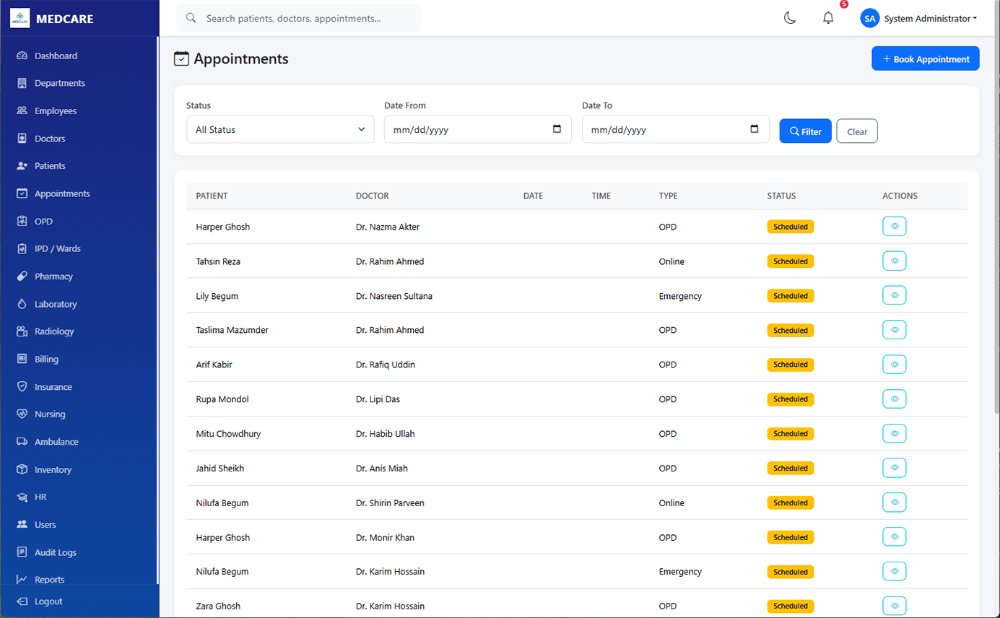

### 🏥 OPD (Outpatient Department)
- OPD visit tracking with auto-generated OPD numbers (`OPD-XXXXXX`)
- Symptoms, diagnosis, treatment, and doctor notes per visit
- Status tracking: Waiting, In-Progress, Completed, Referred

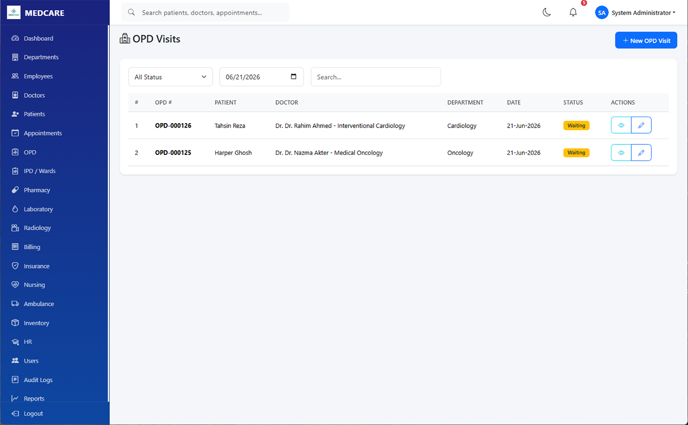

### 🛏️ IPD (Inpatient Department)
- **Ward management** with types: General, Semi-Private, Private, ICU, CCU, ICCU
- **Bed management** with types: Normal, Oxygen, Ventilator, Cardiac
- Bed status tracking: Available, Occupied, Reserved, Maintenance
- Patient admissions with admission type (Emergency, Elective, Referral)
- **Bed transfers** with automatic ward/bed status updates
- Discharge workflow with discharge notes

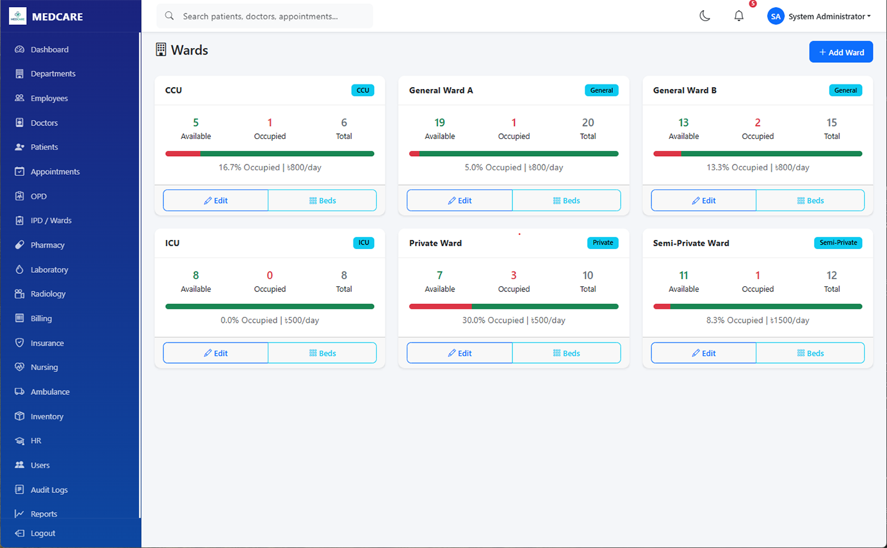

### 💊 Pharmacy
- Medicine catalog with categories (Tablet, Capsule, Syrup, Injection, Ointment, Drops, Inhaler)
- Supplier management with contact details
- Stock tracking with low-stock alerts and expiry warnings (90-day threshold)
- **Prescriptions** linked to visits with items (dosage, frequency, duration, quantity)
- Medicine dispensing workflow with cost tracking

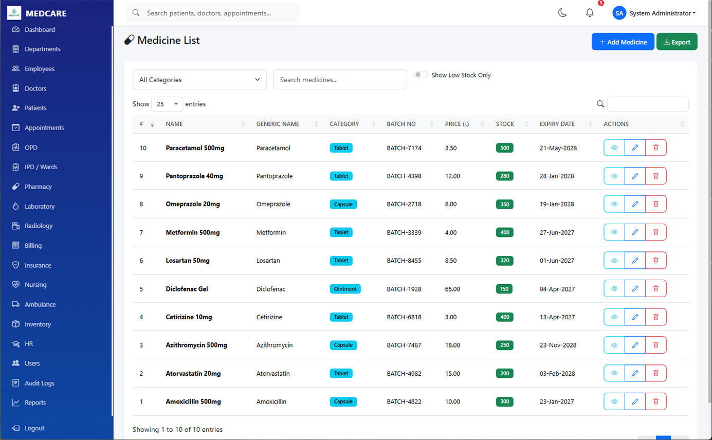
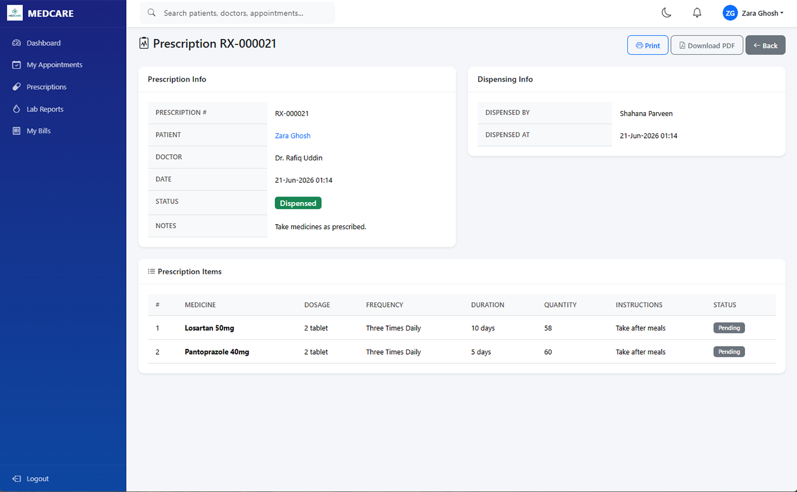

### 🔬 Laboratory
- Lab test catalog with pricing, normal ranges, and units
- Lab orders with priority levels: Routine, Urgent, STAT
- Per-test result entry with abnormal flagging and report file uploads
- Auto-generated order numbers (`LAB-XXXXXX`)

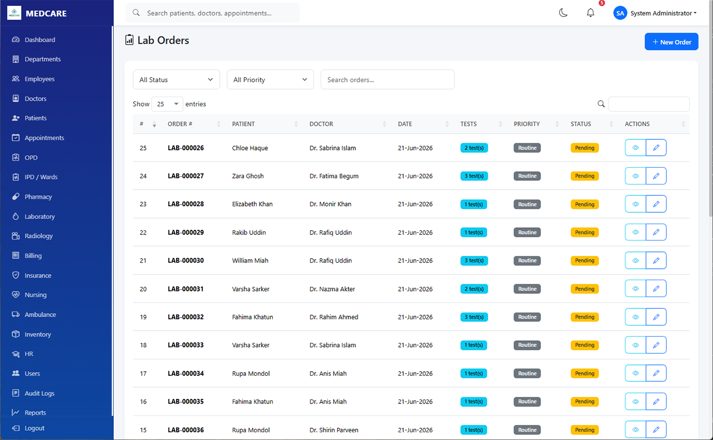

### 📷 Radiology
- Radiology test catalog with pricing
- Orders with priority levels and clinical information
- Reports with findings, impressions, image uploads, and report files
- Auto-generated order numbers (`RAD-XXXXXX`)

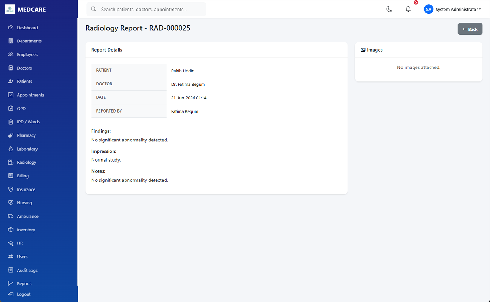

### 💰 Billing & Payments
- **Invoices** with auto-generated numbers (`INV-XXXXXX`), line items, discount, tax, and net amount
- **Payments** with methods: Cash, Card, Bank Transfer, Mobile Banking, Insurance
- Auto-generated **payment receipts** (`REC-XXXXXX`)
- Due tracking with outstanding balance reports
- Revenue reports (daily, weekly, monthly)
- Invoice print view

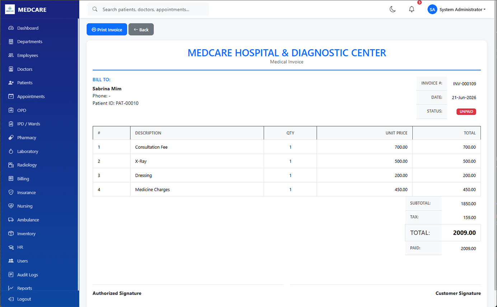
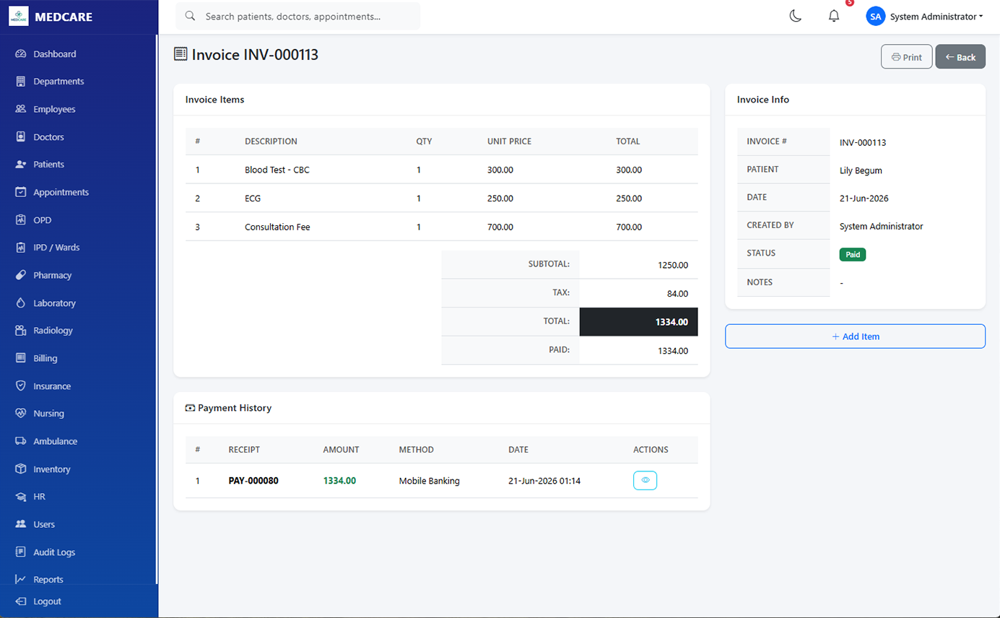

### 🛡️ Insurance
- Insurance provider management
- Insurance plans with coverage percentage and max coverage limits
- Patient insurance enrollment with policy numbers and validity dates
- Expiry tracking

### 💉 Nursing
- Nursing stations linked to wards with nurse-in-charge assignment
- Nursing tasks: Medication, Vitals, Wound Care, IV, Other
- Task status workflow: Pending → In-Progress → Completed / Skipped
- **Vital signs** recording: temperature, blood pressure, heart rate, respiratory rate, SpO2, weight

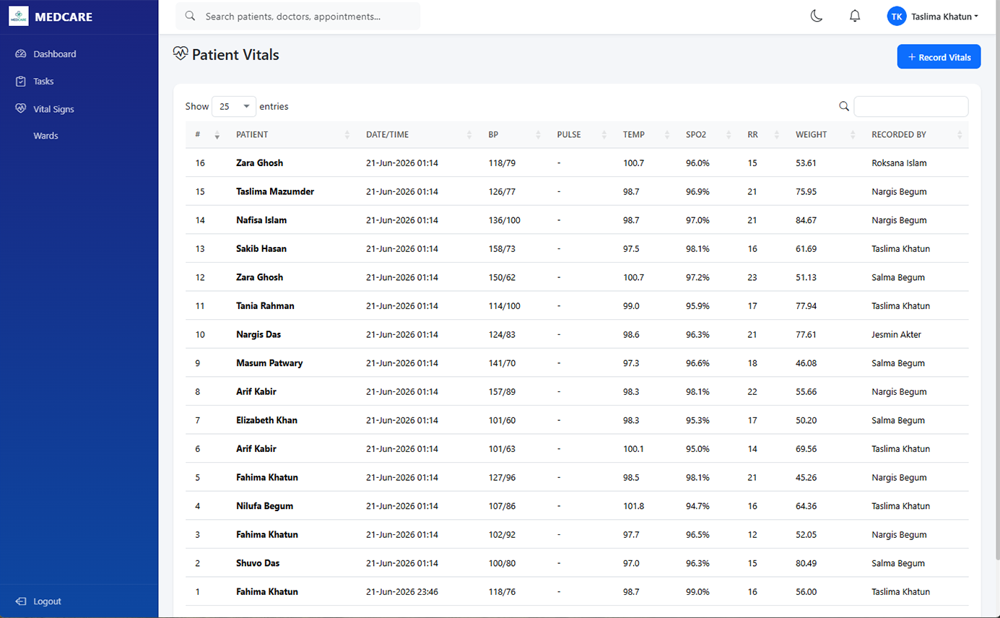

### 🚑 Ambulance
- Ambulance fleet management with types: Basic, AC, ICU
- Ambulance requests with pickup/dropoff locations
- Request status workflow: Pending → Dispatched → In-Transit → Completed / Cancelled
- Driver details and vehicle tracking

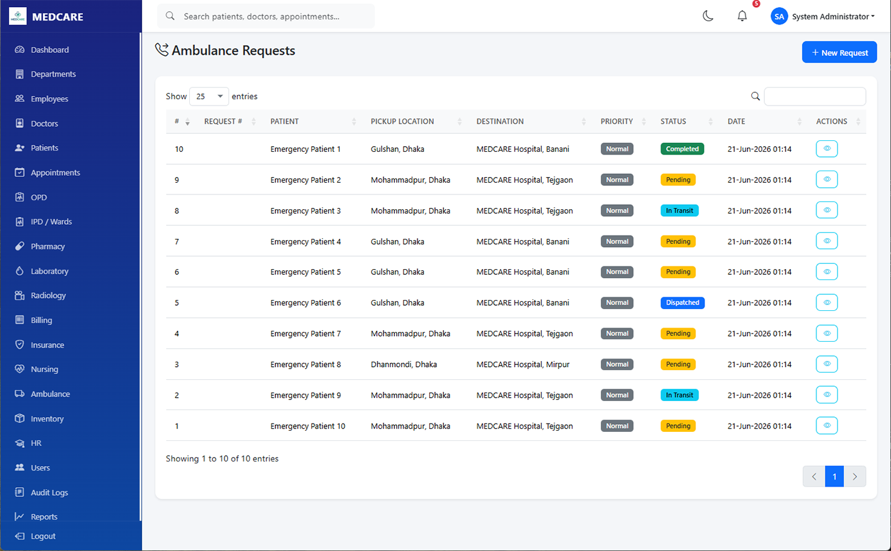

### 📦 Inventory
- Inventory categories with item types: Equipment, Consumable, Supplies, Furniture
- Stock tracking with reorder level alerts and total value calculation
- **Purchase orders** with supplier, quantity, cost, and delivery tracking
- Order status: Pending → Ordered → Delivered / Cancelled

### 👥 HR & Employees
- Employee records with auto-generated IDs (`EMP-XXXXX`), department, designation, salary
- Attendance tracking (Present, Absent, Late, Half Day)
- Leave requests with types: Sick, Casual, Earned, Maternity
- HR records: Appointment, Promotion, Transfer, Increment, Warning, Resignation
- Training management with employee enrollment

### 📊 Reports & Exports
- **7 report modules**: Revenue, Appointments, Patients, Pharmacy, Lab, Inventory, Employees
- Each with date-range filtering and Chart.js visualizations
- **21 export endpoints**: CSV, Excel (openpyxl), and PDF (xhtml2pdf) for each module
- Dashboard charts for revenue trends, department distributions, and top items

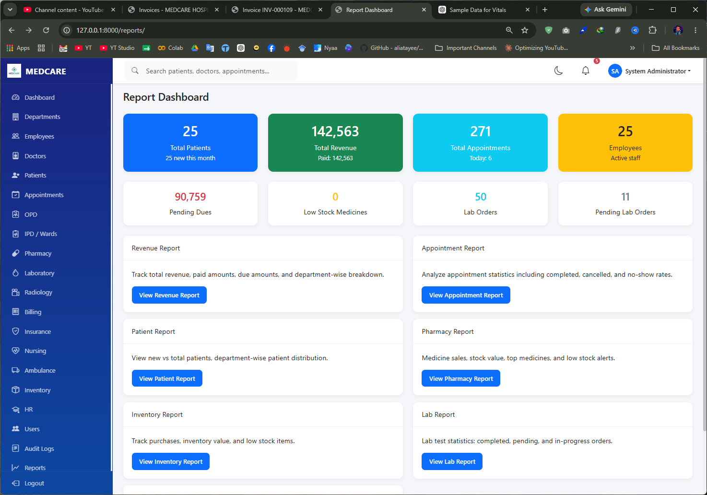

### 📋 Audit Trail
- Automatic logging of all POST/PUT/DELETE operations via custom middleware
- Records user, action type, model, object ID, IP address, user agent, path, and timestamp
- Dedicated audit log viewer for administrators

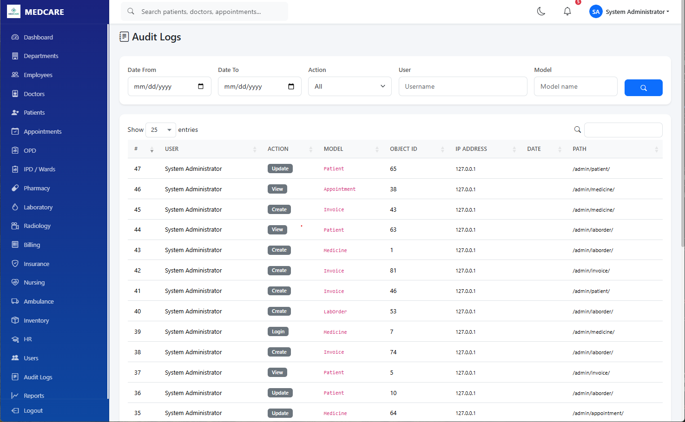

### 🔔 Notifications
- In-app notification system with types: Appointment, Billing, Laboratory, Pharmacy, General, Alert
- Unread count badge in navbar with AJAX-loaded dropdown
- Mark-all-as-read functionality
- Optional deep links to related objects

### 📊 Role-Based Dashboards
- **9 distinct dashboards** tailored to each role
- Admin: full hospital overview with revenue charts, pending tasks, quick actions
- Doctor: today's appointments, patient count, pending consultations
- Patient: upcoming appointments, prescriptions, bills, medical records
- Nurse: pending tasks, admissions, completed tasks
- Receptionist: today's schedule, check-ins, patient count
- Pharmacist: medicine stock, pending prescriptions, dispensing stats
- Lab Technician: pending tests, completed today
- Accountant: revenue, pending invoices, due tracking
- HR Manager: employee count, pending leaves, departments

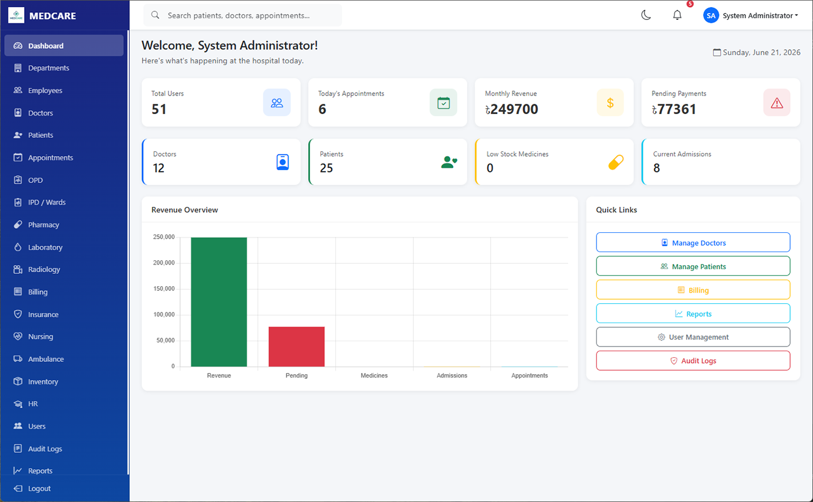
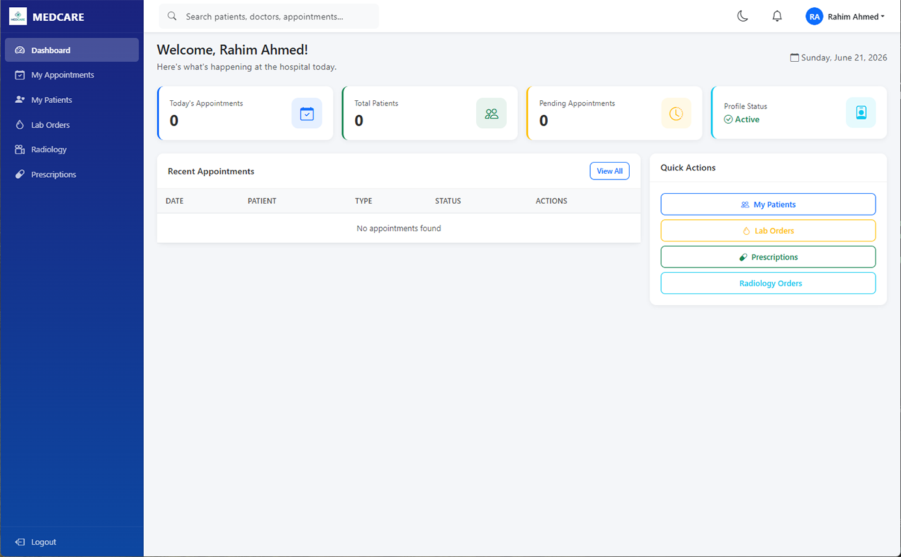
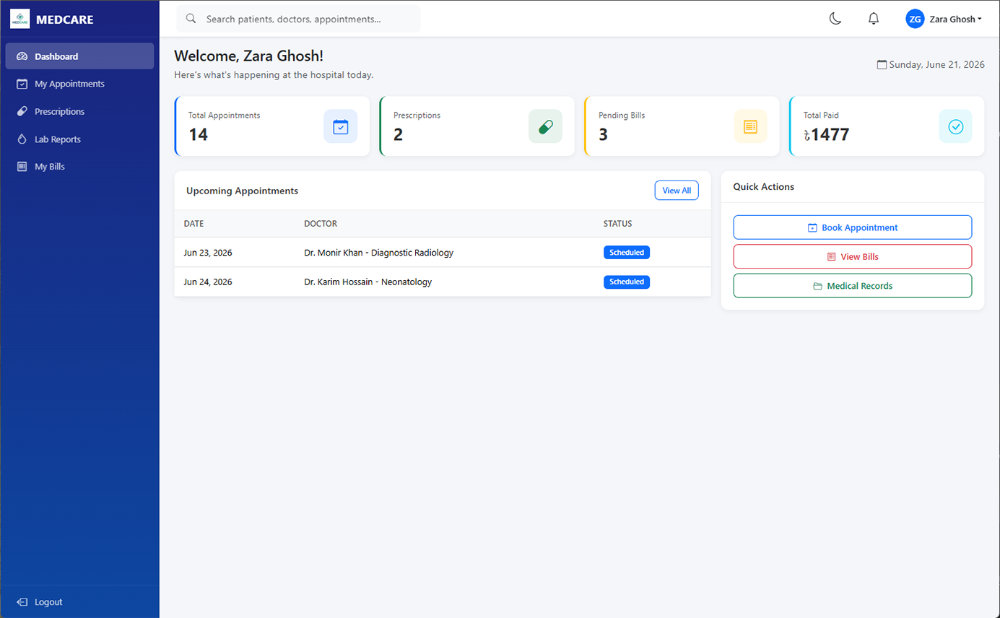

### 🌙 Dark Mode
- Toggle between light and dark themes from the navbar
- Persistent across page navigation

---

## Screenshots
[Screenshots](https://github.com/tasmiul/hospital-management-system-django/tree/main/Screenshots)

---

## Tech Stack

| Layer | Technology |
|-------|-----------|
| **Backend** | [Django 5.0+](https://www.djangoproject.com/) (Python) |
| **Database** | SQLite3 (development) — easily swappable to PostgreSQL / MySQL |
| **Frontend** | [Bootstrap 5.3](https://getbootstrap.com/), [Bootstrap Icons](https://icons.getbootstrap.com/) (CDN) |
| **Forms** | [django-crispy-forms](https://django-crispy-forms.readthedocs.io/) + [crispy-bootstrap5](https://github.com/django-crispy-forms/crispy-bootstrap5) |
| **Tables** | [DataTables](https://datatables.net/) (CDN) |
| **Charts** | [Chart.js](https://www.chartjs.org/) (CDN) |
| **PDF Generation** | [xhtml2pdf](https://github.com/xhtml2pdf/xhtml2pdf) |
| **Excel Export** | [openpyxl](https://openpyxl.readthedocs.io/) |
| **Image Processing** | [Pillow](https://pillow.readthedocs.io/) |
| **Authentication** | Django Auth + Custom User Model with role-based access |
| **Audit Logging** | Custom middleware (`AuditLogMiddleware`) |
| **File Storage** | Django FileSystem (local `media/` directory) |
| **Font** | Segoe UI (system) |

---

## Project Structure

```
Hospital Management System/
├── medcare/                # Django project settings and main URL router
├── accounts/               # Custom User model, roles, authentication, user CRUD
├── core/                   # Dashboard, decorators, mixins, middleware, context processors
├── hospitals/              # Hospital branches
├── departments/            # Departments and specializations
├── employees/              # Employee records, attendance, leave requests
├── doctors/                # Doctor profiles, schedules, availability
├── patients/               # Patient profiles, medical records, documents
├── appointments/           # Appointment booking, visits, status workflow
├── opd/                    # Outpatient Department visits
├── ipd/                    # Inpatient Department — wards, beds, admissions, transfers
├── pharmacy/               # Medicine inventory, prescriptions, dispensing
├── laboratory/             # Lab tests, orders, results
├── radiology/              # Radiology tests, orders, reports
├── billing/                # Invoices, payments, receipts, due tracking
├── insurance/              # Insurance providers, plans, patient enrollment
├── nursing/                # Nursing stations, tasks, vital signs
├── ambulance/              # Ambulance fleet and requests
├── inventory/              # Inventory items, categories, purchase orders
├── hr/                     # Designations, HR records, training
├── reports/                # Report dashboards and CSV/Excel/PDF exports
├── auditlogs/              # Audit trail viewer
├── notifications/          # In-app notification system
├── templates/              # All project templates (Bootstrap 5)
├── static/                 # CSS, JavaScript, images
├── media/                  # User-uploaded files (profile photos, documents)
├── requirements.txt        # Python dependencies
└── manage.py               # Django management script
```

---

## Quick Start

### Prerequisites
- Python 3.10+
- pip

### Installation

```bash
# 1. Clone the repository
git clone https://github.com/tasmiul/hospital-management-system-django.git
cd hospital-management-system

# 2. Create and activate a virtual environment
python -m venv env
# Windows:
env\Scripts\activate
# macOS / Linux:
source env/bin/activate

# 3. Install dependencies
pip install -r requirements.txt

# 4. Run migrations
python manage.py migrate

# 5. Create a superuser (admin)
python manage.py createsuperuser

# 6. (Optional) Load demo data
python manage.py seed_demo

# 7. Start the development server
python manage.py runserver

# 8. Open in browser
#    http://127.0.0.1:8000/
```

---

## Default Credentials

> **⚠️ Change these immediately in production.**

After running `seed_demo`:

| Role | Username | Password |
|------|----------|----------|
| **Admin** | `admin` | `admin123` |
| **Doctor** | `dr.rahim.ahmed` | `doctor123` |
| **Nurse** | `nurse.taslima.khatun` | `nurse123` |
| **Patient** | `patient.zara.ghosh` | `patient123` |
| **Pharmacist** | `pharm.kamal.hossain` | `pharmacist123` |
| **Lab Technician** | `lab.nadia.akter` | `lab123` |
| **Accountant** | `acct.farhan.islam` | `accountant123` |
| **Receptionist** | `recep.sumon.mia` | `receptionist123` |
| **HR Manager** | `hr.nusrat.jahan` | `hr123` |

Demo data includes: 14 departments, 12+ doctors with schedules, 25+ patients, 400+ appointments, prescriptions, lab/radiology orders, billing records, IPD wards/beds/admissions, ambulance fleet, inventory items, HR records, and more.

---

## Usage Guide

### For Administrators
1. **Login** with admin credentials
2. **Dashboard** shows hospital-wide stats: revenue, appointments, admissions, stock alerts
3. **Departments** → Manage departments and specializations across branches
4. **Employees** → Add staff, track attendance, manage leave requests
5. **Doctors** → Create doctor profiles, set schedules and availability
6. **Patients** → Register patients, view medical records and documents
7. **Appointments** → Manage the full appointment lifecycle
8. **Billing** → Create invoices, record payments, track dues
9. **Reports** → View analytics and export data in CSV/Excel/PDF
10. **Users** → Manage user accounts and role assignments
11. **Audit Logs** → Review all system activity

### For Doctors
1. **Login** with doctor credentials
2. **Dashboard** shows today's appointments and patient count
3. **My Appointments** → View and manage your appointment schedule
4. **My Patients** → Access patient records and medical history
5. **Lab Orders** → Order lab tests and view results
6. **Radiology** → Order radiology exams and view reports
7. **Prescriptions** → Create prescriptions linked to visits

### For Patients
1. **Register** a new account or **login** with patient credentials
2. **Dashboard** shows upcoming appointments, prescriptions, and bills
3. **My Appointments** → View appointment history and upcoming visits
4. **Prescriptions** → View prescribed medications
5. **Lab Reports** → Access lab test results
6. **My Bills** → View invoices and payment history

### For Nurses
1. **Login** with nurse credentials
2. **Dashboard** shows pending tasks and current admissions
3. **Tasks** → View and update nursing tasks (medication, vitals, wound care)
4. **Vital Signs** → Record patient vital signs
5. **Wards** → View ward and bed occupancy

### For Pharmacists
1. **Login** with pharmacist credentials
2. **Dashboard** shows medicine stock and pending prescriptions
3. **Medicines** → Manage medicine inventory
4. **Prescriptions** → Dispense medications against prescriptions
5. **Stock Alerts** → View low-stock and expiring medicines

### For Lab Technicians
1. **Login** with lab technician credentials
2. **Dashboard** shows pending and completed tests
3. **Lab Orders** → Process orders and enter results
4. **Lab Tests** → Manage the test catalog

### For Accountants
1. **Login** with accountant credentials
2. **Dashboard** shows revenue stats and pending invoices
3. **Invoices** → Create and manage invoices
4. **Payments** → Record and track payments
5. **Due Tracking** → Monitor outstanding balances
6. **Reports** → Generate revenue reports

### For Receptionists
1. **Login** with receptionist credentials
2. **Dashboard** shows today's schedule and pending check-ins
3. **Patients** → Register and manage patient records
4. **Appointments** → Book and manage appointments
5. **Billing** → Create invoices and record payments
6. **Insurance** → Manage patient insurance enrollment

### For HR Managers
1. **Login** with HR manager credentials
2. **Dashboard** shows employee count and pending leave requests
3. **Employees** → Manage employee records
4. **Leave Requests** → Approve or reject leave applications
5. **Trainings** → Organize and track employee training programs

---

## Deployment

### Production Checklist
- [ ] Set `DEBUG=False` and configure `ALLOWED_HOSTS` in `medcare/settings.py`
- [ ] Use a strong, unique `SECRET_KEY` (move to environment variable)
- [ ] Configure a production database (PostgreSQL or MySQL)
- [ ] Set up a proper email backend (SMTP) for notifications
- [ ] Serve static and media files via Nginx or a CDN
- [ ] Use HTTPS with a valid SSL certificate
- [ ] Change all default credentials
- [ ] Configure `STATIC_ROOT` and run `python manage.py collectstatic`
- [ ] Set up Gunicorn or uWSGI as the application server
- [ ] Configure Nginx as a reverse proxy

### Dependencies

```
Django>=5.0,<7.0
django-crispy-forms>=2.0
crispy-bootstrap5>=0.7
Pillow>=10.0
openpyxl>=3.1
xhtml2pdf>=0.2.11
```

## License

This project is licensed under the **MIT License**. See the [LICENSE](LICENSE) file for details.

```
MIT License

Copyright (c) 2026 Tasmiul Alam Shopnil 

Permission is hereby granted, free of charge, to any person obtaining a copy
of this software and associated documentation files (the "Software"), to deal
in the Software without restriction, including without limitation the rights
to use, copy, modify, merge, publish, distribute, sublicense, and/or sell
copies of the Software, and to permit persons to whom the Software is
furnished to do so, subject to the following conditions:

The above copyright notice and this permission notice shall be included in all
copies or substantial portions of the Software.

THE SOFTWARE IS PROVIDED "AS IS", WITHOUT WARRANTY OF ANY KIND, EXPRESS OR
IMPLIED, INCLUDING BUT NOT LIMITED TO THE WARRANTIES OF MERCHANTABILITY,
FITNESS FOR A PARTICULAR PURPOSE AND NONINFRINGEMENT. IN NO EVENT SHALL THE
AUTHORS OR COPYRIGHT HOLDERS BE LIABLE FOR ANY CLAIM, DAMAGES OR OTHER
LIABILITY, WHETHER IN AN ACTION OF CONTRACT, TORT OR OTHERWISE, ARISING FROM,
OUT OF OR IN CONNECTION WITH THE SOFTWARE OR THE USE OR OTHER DEALINGS IN THE
SOFTWARE.
```

---

## Acknowledgments

- Built with [Django](https://www.djangoproject.com/)
- UI styled with [Bootstrap 5](https://getbootstrap.com/)
- Icons by [Bootstrap Icons](https://icons.getbootstrap.com/)
- Charts powered by [Chart.js](https://www.chartjs.org/)
- PDF generation by [xhtml2pdf](https://github.com/xhtml2pdf/xhtml2pdf)
- Excel exports via [openpyxl](https://openpyxl.readthedocs.io/)
